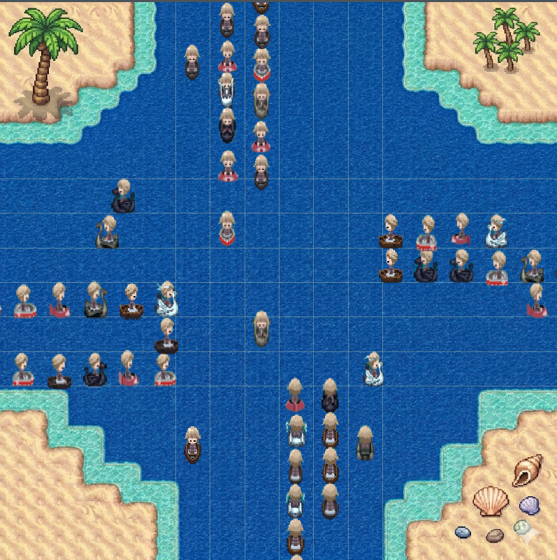
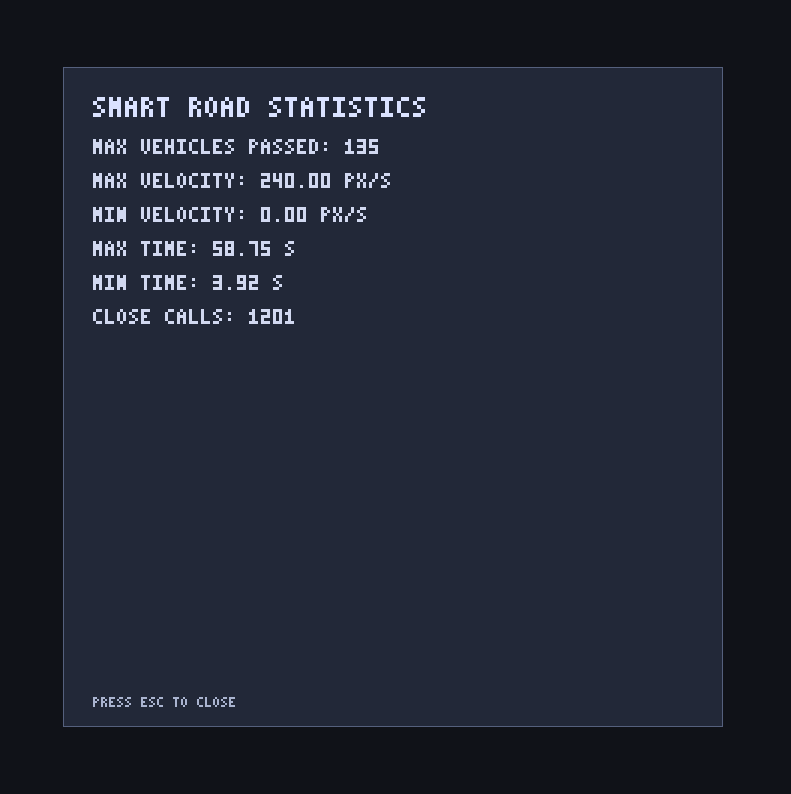

# Smart Road Intersection

A Rust + SDL2 simulation of a four-way smart intersection for autonomous vehicles.

## Overview

This project simulates autonomous vehicles moving through a cross intersection with lane-based routing:

- Right-turn lane
- Straight lane
- Left-turn lane

Vehicles are generated from all four directions, follow fixed routes, keep safe spacing, and are coordinated inside a central conflict area using a reservation-based algorithm.

## Simulator and Statistics

| Simulator | Statistics |
| --- | --- |
|  |  |

## Implemented Features

- 4-way intersection simulation loop (60 FPS target)
- Route-based vehicle movement with dedicated lanes
- Three speed levels per vehicle (`Slow`, `Medium`, `Fast`)
- Same-lane following logic with safe-distance checks
- Conflict-zone reservation system to reduce intersection conflicts
- Vehicle spawning using keyboard input
- Continuous random spawning mode
- Runtime statistics collection and end-screen display
- Sprite-based rendering and direction-aware animation

## Controls

- `Arrow Up`: spawn vehicle from south to north
- `Arrow Down`: spawn vehicle from north to south
- `Arrow Right`: spawn vehicle from west to east
- `Arrow Left`: spawn vehicle from east to west
- `R`: toggle continuous random vehicle spawning
- `Esc`: stop simulation and show statistics

## Statistics Collected

- Maximum number of vehicles passed
- Maximum velocity reached
- Minimum velocity reached
- Maximum crossing time
- Minimum crossing time
- Number of close calls

## Physics Model

Each vehicle tracks:

- `time` (entry-to-exit crossing time)
- `distance` (distance traveled while active)
- `velocity` (current speed state)

The simulation updates movement every tick and applies safe-following and conflict-zone constraints.

## Project Structure

- `src/main.rs`: main loop, input, spawning, updates, and orchestration
- `src/intersection.rs`: lane geometry, routes, and conflict-zone reservations
- `src/vehicle.rs`: vehicle model, movement, and per-vehicle physics state
- `src/animation.rs`: sprite-sheet direction/frame logic
- `src/renderer.rs`: map, vehicles, overlay lines, and stats screen rendering
- `src/stats.rs`: metrics tracking and report formatting
- `src/assets/`: map and vehicle sprites

## Dependencies

- `sdl2` (with `unsafe_textures`)
- `png`
- `rand`

## Build and Run (Windows)

This project is configured for the GNU target and MSYS2 UCRT64 toolchain.

In PowerShell:

```powershell
$env:PATH = "C:\msys64\ucrt64\bin;$env:PATH"
$env:CARGO_TARGET_DIR = "C:\cargo-target-smartroad"
cargo run
```

If needed (first-time setup):

```powershell
rustup target add x86_64-pc-windows-gnu
```

## Notes

- The simulation uses a central reservation/conflict-zone strategy to control intersection entry.
- Path and lane tuning can be adjusted in `src/intersection.rs`.
- Rendering sizes and guide-line spacing can be tuned in `src/renderer.rs`.
